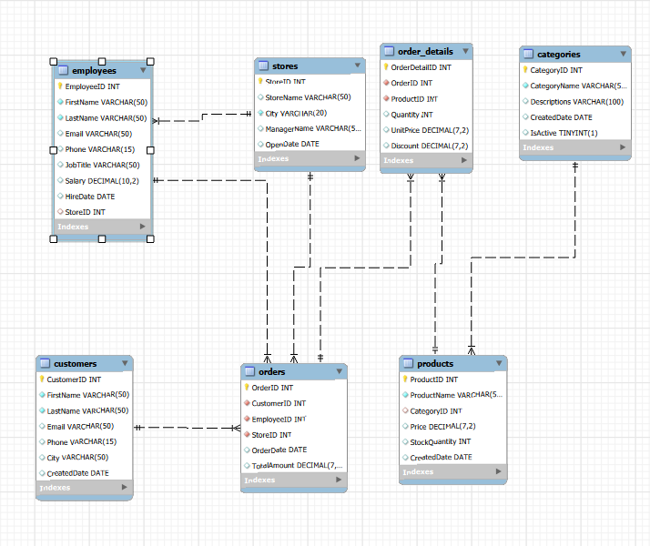

# Winners-Retail-Store-Analysis - SQL

---

# <p align="center">
  
</p>
# Winners Retail Sales SQL Project  

## 📌 Project Overview
This project demonstrates advanced SQL analytics using a simulated retail business database.  
The goal was to analyze the sales and operations of a retail store chain to identify trends, high-performing products, top customers, and employee performance using SQL.

## Table of Contents
- [Project Overview](#-project-overview)
- [Database Schema](#-database-schema)
- [Technologies Used](#%EF%B8%8F-technologies-used)
- [Business Questions & SQL Solutions](#-business-questions-solved)
  - [Customer Analytics](#customer-analytics)
  - [Product Analytics](#product-analytics)
  - [Employee Performance](#employee-performance)
  - [Sales Trends](#sales-trends)
- [Key Insights](#-key-insights)
- [Author](#-author)

The project covers:

- Database schema design
- Data cleaning & loading
- Complex joins
- Aggregations & KPIs
- Window functions
- Business analytics queries

---

## 🧱 Database Schema

The database consists of the following tables:

- **Customers**
- **Orders**
- **Order_Details**
- **Products**
- **Categories**
- **Employees**
- **Stores**

### Entity Relationship Overview

<p align="center">
  
</p>

---

## ⚙️ Technologies Used

- MySQL
- MySQL Workbench
- Excel (Data preparation)
- Git & GitHub

---

## 📊 Business Questions Solved

### Customer Analytics
- Customers with highest lifetime spending
- Customers visiting multiple stores
- Percentage of one-time buyers
- Average order value per customer

### Product Analytics
- Best-selling products
- Revenue per category
- Products never sold
- Monthly top-selling products

### Employee Performance
- Revenue handled per employee
- Employees serving most customers
- Top-performing employees

### Sales Trends
- Monthly revenue trends
- Store performance by month
- Daily order averages
- Peak revenue periods

---

## 🧠 Advanced SQL Concepts Demonstrated

✔ Multi-table JOINs  
✔ CTEs (Common Table Expressions)  
✔ Window Functions (`RANK`, `AVG OVER`)  
✔ Aggregations & Grouping  
✔ Subqueries  
✔ Business KPI calculations  

---


## Solving Real-World Business Problems with SQL

### 🧾 Data Understanding & Joins   

#### **Problem 1:** List all orders along with the customer name, store name, and employee who handled the order.
#### 👉 Purpose: Measure how much each product sells and understand performance by category.
```sql
SELECT 
    o.OrderID,
    CONCAT(c.firstname, ' ', c.lastname) AS customername,
    s.StoreName,
    CONCAT(e.firstname, ' ', e.lastname) AS employeename
FROM
    orders o
        JOIN
    customers c ON o.customerID = c.customerID
        JOIN
    employees e ON o.employeeID = e.employeeID
        JOIN
    stores s ON o.storeID = s.storeID;
```

#### **Problem 2:** Show each product sold along with its category and the total quantity sold.
#### 👉 Purpose: Measure how much each product sells and understand performance by category.
```sql
SELECT 
    p.productname,
    p.categoryID,
    SUM(od.quantity) AS Total_Quantity_sold,
    c.categoryname
FROM
    order_details od
        JOIN
    products p ON od.productID = p.productID
        JOIN
    categories c ON p.categoryID = c.categoryID
GROUP BY p.productID;
```

#### **Problem 3:** List all customers who have placed at least one order, showing their orders and total spent.
#### 👉 Purpose: Identify customer value by calculating how much each customer has spent overall.
```sql
SELECT 
    o.customerID,
    CONCAT(c.firstname, ' ', c.lastname) AS customername,
    SUM(o.totalamount) AS Total_spent
FROM
    orders o
        JOIN
    customers c ON o.customerID = c.customerID
GROUP BY c.CustomerID;
```

#### **Problem 4:** Identify orders where the employee’s store is different from the store where the order was placed.
#### 👉 Purpose: Detect operational inconsistencies or cross-store servicing behavior.
```sql
SELECT 
    o.orderID,
    o.employeeID,
    o.storeID AS order_store,
    e.storeID AS employee_store
FROM
    orders o
        JOIN
    employees e ON o.employeeID = e.employeeID
WHERE
    o.storeID != e.storeID;
```

#### **Problem 5:** Show the top 10 customers by total spending across all orders.
#### 👉 Purpose: Find high-value customers for loyalty programs and targeted marketing.
```sql
SELECT 
    CONCAT(c.firstname, ' ', c.lastname) AS customername,
    o.customerID,
    SUM(o.totalamount) AS total_spent
FROM
    orders o
        JOIN
    customers c ON o.customerID = c.customerID
GROUP BY o.customerID , customername
ORDER BY total_spent DESC
LIMIT 10;
```

### 🏪 Store & Revenue Analysis
#### **Problem 6:** Calculate total revenue generated by each store.
#### 👉 Purpose: Compare store performance and revenue contribution.
```sql
SELECT 
    storeID, SUM(totalamount) AS total_revenue
FROM
    orders
GROUP BY storeID;
```

#### **Problem 7:** Find the average order value per store.
#### 👉 Purpose: Evaluate sales efficiency of each store.
```sql
SELECT 
    storeID, AVG(totalamount) AS avg_order_value
FROM
    orders
GROUP BY storeID;
```

#### **Problem 8:** Determine total revenue per product category.
#### 👉 Purpose: Identify which categories generate the most income.
```sql
SELECT 
    c.categoryID,
    categoryname,
    SUM(quantity * unitprice) AS category_revenue
FROM
    categories c
        JOIN
    products p ON c.categoryID = p.categoryID
        JOIN
    order_details od ON p.productID = od.productID
GROUP BY c.categoryID , categoryname;
```

#### **Problem 9:** Identify the top 5 best-selling products by quantity sold.
#### 👉 Purpose: Find products with highest demand for inventory planning.
```sql
SELECT 
    p.productID,
    p.productname,
    p.categoryID,
    SUM(quantity) AS total_quantity
FROM
    products p
        JOIN
    order_details od ON p.productID = od.productID
GROUP BY p.productID , p.productname , p.categoryID
ORDER BY total_quantity DESC LIMIT 5;
```

#### **Problem 10:** Calculate the average discount applied per product across all orders.
#### 👉 Purpose: Analyze discount strategies and pricing behavior.
```sql
SELECT 
    productID,
    SUM(quantity) AS total_product_sold,
    sum(discount*quantity)/sum(quantity) AS avg_discount_per_product
FROM
    order_details
GROUP BY productID;
```

#### **Problem 11:** Identify the top 3 revenue-generating products in each category.
#### 👉 Purpose:
```sql
WITH category_totals AS(	
    SELECT 
		c.categoryID,
		c.categoryname,
		p.productID,
		p.productname,
		SUM(o.totalamount) AS total_revenue,
		rank() over(partition by c.categoryID order by SUM(o.totalamount) desc) as rank_in_cat
	FROM
		products p
			JOIN
		order_details od ON p.productID = od.productID
			JOIN
		categories c ON p.categoryID = c.categoryID
			JOIN
		orders o ON o.orderID = od.orderID
	GROUP BY p.productID
	)

SELECT * FROM category_totals 
WHERE rank_in_cat <=3;
```

#### **Problem 12:** Find products that have never been sold.
#### 👉 Purpose:
```sql
SELECT 
    p.productID,
    p.productname,
    COUNT(od.productID) AS order_count
FROM
    products p
        LEFT JOIN
    order_details od ON p.productID = od.productID
GROUP BY p.productID , p.productname
having order_count= 0;
```

#### **Problem 13:** Calculate total revenue generated per product.
#### 👉 Purpose:
```sql
SELECT 
    p.productID,
    p.productname,
    SUM(od.quantity) AS quantity_sold,
    ROUND(SUM(od.unitprice * od.quantity * (1 - od.discount / 100)),
            2) AS total_product_revenue
FROM
    products p
        JOIN
    order_details od ON p.productID = od.productID
GROUP BY p.productID , p.productname;
```

#### **Problem 14:** Determine the average quantity sold per order for each product.
#### 👉 Purpose:
```sql
SELECT 
    od.productID,
    COUNT(o.orderID) AS order_count,
    SUM(od.quantity) AS total_units_sold,
    ROUND(SUM(od.quantity) / COUNT(o.orderID), 2) AS avg_quantity_sold_per_order
FROM
    orders o
        JOIN
    order_details od ON o.orderID = od.orderID
GROUP BY od.productID;
```

#### **Problem 15:** Identify products with total sales revenue greater than the average product revenue.
#### 👉 Purpose:
```sql
WITH total_revenue AS (
	SELECT
		productID,
		round(sum(quantity * unitprice * (1-discount/100)), 2) AS product_revenue,
		AVG(sum(quantity * unitprice * (1-discount/100))) OVER () AS avg_revenue
	FROM order_details
	GROUP BY productID
    )
    
 SELECT
	productID,
    product_revenue,
    avg_revenue
FROM total_revenue
WHERE product_revenue > avg_revenue;
```


## 👥 Customer Analytics
#### **Problem 16:** Identify customers who have placed more than 5 orders.
#### 👉 Purpose: Identify repeat customers and measure customer loyalty.
```sql
SELECT 
    c.customerID,
    CONCAT(c.firstname, ' ', c.lastname) AS customername,
    COUNT(o.orderID) AS order_count
FROM
    orders o
        JOIN
    customers c ON o.customerID = c.customerID
GROUP BY c.customerID , customername
HAVING order_count > 5;
```

#### **Problem 17:** Find the top 10 customers with the highest lifetime spending.
#### 👉 Purpose: Recognize customers contributing the most long-term revenue.
```sql
SELECT 
    c.customerID,
    CONCAT(c.firstname, ' ', c.lastname) AS customername,
    COUNT(o.orderID) order_count,
    SUM(totalamount) AS lifetime_spending
FROM
    customers c
        JOIN
    orders o ON c.customerID = o.customerID
GROUP BY c.customerID, customername
ORDER BY lifetime_spending DESC
LIMIT 10;
```

#### **Problem 18:** Calculate the average order value for each customer.
#### 👉 Purpose: Understand customer purchasing power and spending behavior.
```sql
WITH customer_totals AS
	(SELECT 
		c.customerID,
		CONCAT(c.firstname, ' ', c.lastname) AS customername,
		COUNT(o.orderID) order_count,
		SUM(totalamount) AS lifetime_spending
	FROM
		customers c
			JOIN
		orders o ON c.customerID = o.customerID
	GROUP BY c.customerID
)

SELECT 
	customerID, 
	customername,
	order_count, 
	lifetime_spending,
	lifetime_spending/ order_count AS avg_order_value
from customer_totals;
```

#### **Problem 19:** List customers who have placed orders in more than one store.
#### 👉 Purpose: Identify cross-store shoppers, indicating strong brand engagement.
```sql
SELECT 
    c.customerID,
    c.firstname,
    c.lastname,
    COUNT(DISTINCT o.storeID) AS stores_visited
FROM
    customers c
        JOIN
    orders o ON c.customerID = o.customerID
GROUP BY c.customerID , c.firstname , c.lastname
HAVING stores_visited > 1;
```

#### **Problem 20:** Calculate the percentage of customers who have placed only one order.
#### 👉 Purpose: Measure customer retention vs churn.
```sql
WITH customer_summary AS(
	SELECT 
		c.customerID,
		COUNT(o.orderID) AS order_count
	FROM
		customers c
			LEFT JOIN
		orders o ON c.customerID = o.customerID
	GROUP BY c.customerID
	HAVING order_count = 1)

    
SELECT 
	COUNT(customerID)*100/ (SELECT COUNT(customerID) FROM customers)
	AS percent_one_time_orderers 
FROM customer_summary;
```


## 👨‍💼 Employee Performance Analytics
#### **Problem 21:** Calculate total sales handled by each employee.
#### 👉 Purpose: Measure employee contribution to revenue.
```sql
SELECT 
    o.employeeID,
    CONCAT(e.firstname, ' ', e.lastname) AS employee_name,
    SUM(o.totalamount) AS total_sales_handeled
FROM
    order_details od
        JOIN
    orders o ON od.orderID = o.orderID
        JOIN
    employees e ON o.employeeID = e.employeeID
GROUP BY e.employeeID;
```

#### **Problem 22:** Identify the top 5 employees who generated the highest revenue.
#### 👉 Purpose: Recognize top performers for incentives or evaluation.
```sql
SELECT 
    o.employeeID,
    CONCAT(e.firstname, ' ', e.lastname) AS employee_name,
    SUM(o.totalamount) AS total_sales_handeled
FROM
    order_details od
        JOIN
    orders o ON od.orderID = o.orderID
        JOIN
    employees e ON o.employeeID = e.employeeID
GROUP BY e.employeeID
ORDER BY SUM(o.totalamount) DESC
LIMIT 5;
```

#### **Problem 23:** Determine the average order value handled by each employee.
#### 👉 Purpose: Evaluate employee effectiveness in handling higher-value sales.
```sql
SELECT 
    e.employeeID,
    CONCAT(e.firstname, ' ', e.lastname) AS employee_name,
    ROUND(AVG(o.totalamount), 2) AS avg_order_value_handled
FROM
    employees e
        JOIN
    orders o ON e.employeeID = o.employeeID
GROUP BY e.employeeID;
```

#### **Problem 24:** Find employees who handled orders for more than 40 unique customers.
#### 👉 Purpose: Identify employees with strong customer interaction reach.
```sql
SELECT 
    o.employeeID,
    CONCAT(e.firstname, ' ', e.lastname) AS employee_name,
    COUNT(DISTINCT o.customerID) AS unique_customers
FROM
    employees e
        JOIN
    orders o ON e.employeeID = o.employeeID
GROUP BY o.employeeID , employee_name
HAVING unique_customers > 40;
```

#### **Problem 25:** Identify the employee with the highest total quantity of products sold.
#### 👉 Purpose: Find employees driving the most product movement.
```sql
WITH emp_units_sold AS(
    SELECT 
		o.employeeID,
		CONCAT(e.firstname, ' ', e.lastname) AS employee_name,
		SUM(od.quantity) AS units_sold
	FROM
		employees e
			JOIN
		orders o ON e.employeeID = o.employeeID
			JOIN
		order_details od ON o.orderID = od.OrderID
	GROUP BY o.employeeID
)

SELECT 
	employeeID, 
    employee_name, 
    units_sold 
FROM emp_units_sold
WHERE units_sold = (SELECT max(units_sold) FROM emp_units_sold);
```

## 📈 Sales Trend & Time Analysis
#### **Problem 26:** Calculate monthly revenue trends across all stores.
#### 👉 Purpose: Track business growth and seasonal performance.
```sql
SELECT 
    YEAR(orderdate) AS sale_year,
    MONTH(orderdate) AS sale_month,
    SUM(totalamount) AS revenue
FROM
    orders
GROUP BY sale_year , sale_month
ORDER BY sale_year , sale_month;
```

#### **Problem 27:** Determine the store with the highest sales for each month.
#### 👉 Purpose: Compare store dominance over time.
```sql
WITH monthly_totals AS(	
    SELECT 
		YEAR(o.orderdate) AS sale_year,
		MONTH(o.orderdate) AS sale_month,
		o.storeID,
		s.storename,
		SUM(o.totalamount) AS revenue,
        RANK() OVER (PARTITION BY YEAR(o.orderdate), 
			MONTH(o.orderdate)
			ORDER BY SUM(o.totalamount) DESC) AS monthly_rank
	FROM
		orders o
			JOIN
		stores s ON o.storeID = s.storeID
	GROUP BY sale_year , sale_month , o.storeID , s.storename
)

SELECT 
	sale_year, 
    sale_month, 
    storeID, 
    storename, 
    revenue, 
    monthly_rank
FROM monthly_totals
WHERE monthly_rank = 1;
```

#### **Problem 28:** Identify the top selling product each month.
#### 👉 Purpose: Identify changing customer preferences over time.
```sql
WITH monthly_sales_quantity AS(	
    SELECT 
		YEAR(o.orderdate) AS sale_year,
		MONTH(o.orderdate) AS sale_month,
		p.productID,
		p.productname,
		SUM(od.quantity) AS units_sold,
		RANK() OVER(PARTITION BY YEAR(o.orderdate), MONTH(o.orderdate)
		ORDER BY SUM(od.quantity) DESC) AS monthly_rank
	FROM
		orders o
			JOIN
		order_details od ON o.orderID = od.orderID
			JOIN
		products p ON od.productID = p.productID
	GROUP BY sale_year , sale_month , p.productID , p.productname
)

SELECT 
	sale_year, 
    sale_month, 
    productID, 
    productname, 
    units_sold, 
    monthly_rank
FROM monthly_sales_quantity
WHERE monthly_rank = 1;
```

#### **Problem 29:** Calculate the daily average number of orders.
#### 👉 Purpose: Understand daily business activity level.
```sql
WITH daily_order_count AS(	
    SELECT 
		orderdate, COUNT(*) AS daily_order
	FROM
		orders
	GROUP BY orderdate
)

SELECT 
	ROUND(AVG(daily_order), 2) AS avg_order_per_day
FROM daily_order_count;
```

#### **Problem 30:** Find the month with the highest total revenue.
#### 👉 Purpose: Determine peak sales period for strategic planning and promotions.
```sql
WITH monthly_revenue AS(	
    SELECT 
		MONTH(orderdate) AS sale_month,
		SUM(totalamount) AS revenue
	FROM
		orders
	GROUP BY sale_month
)

SELECT 
	sale_month,
    revenue
FROM monthly_revenue
WHERE revenue = (SELECT 
                    MAX(revenue) 
                    FROM 
                    monthly_revenue
);
```
---
## 📈 Key Insights

- Identified top revenue-generating product categories
- Measured employee sales performance
- Analyzed customer purchasing behavior
- Tracked seasonal revenue patterns

---

## 👤 Author

**Abiskar Shiwakoti**

Data Analyst | SQL | Data Analytics

GitHub: https://github.com/ASHIWAKOTI-eng 
LinkedIn: (https://www.linkedin.com/in/a-shiwakoti-b04702238/)
---

## ⭐ Project Purpose

This project was created as part of a data analytics portfolio to demonstrate practical SQL skills used in real business environments.
